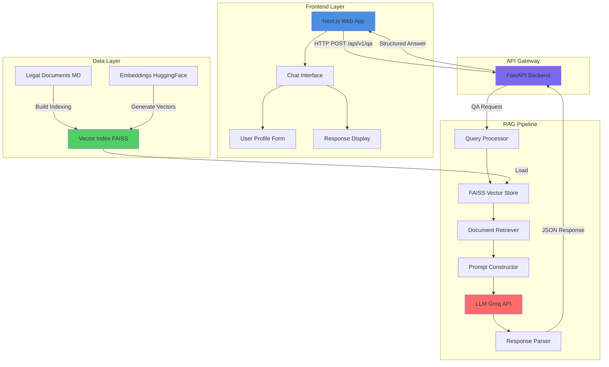
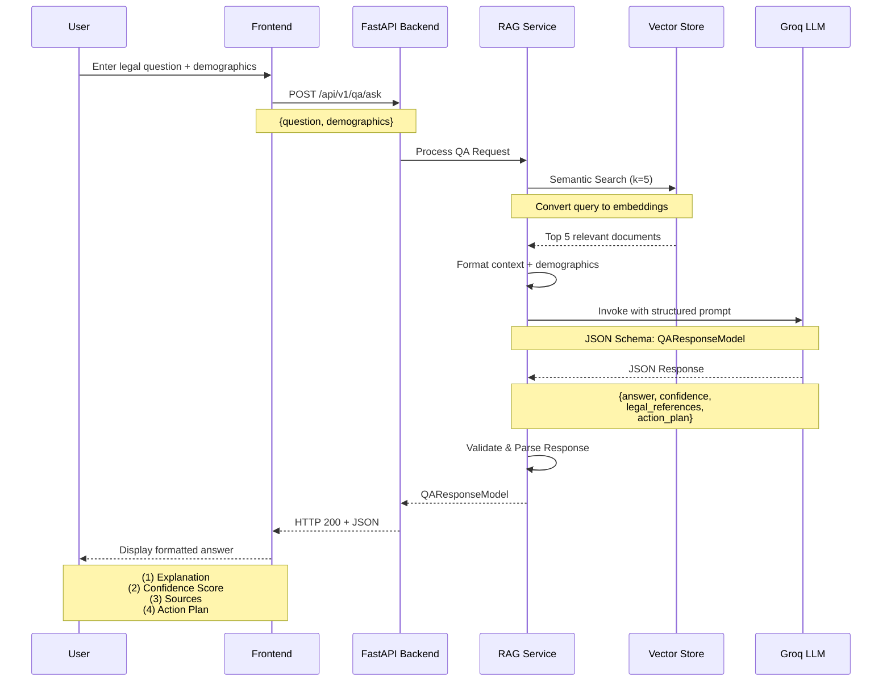
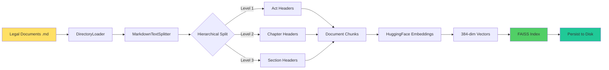

# Legal Sahayak: RAG‑Based Explainable Legal Aid System for Community Empowerment

[](https://opensource.org/licenses/MIT)
[](https://www.python.org/)
[](https://nextjs.org/)
[](https://fastapi.tiangolo.com/)


## 🚨 Problem Statement

Every day, millions of common people across India face situations requiring timely legal advice—ranging from landlord disputes and consumer rights to family law and labor issues. However:

### 1. **Immediate Help Unavailable**

Legal aid clinics and lawyers are often inaccessible due to cost, geography, or language barriers. In rural Madhya Pradesh, the lawyer-to-population ratio is approximately **1:10,000** compared to the national average of 1:1,200, leaving vast populations without legal representation.

### 2. **Complexity of Legal Texts**

National and state laws are voluminous, jargon‑laden, and constantly updated, making manual search slow and error‑prone. The Bharatiya Nyaya Sanhita (BNS) 2023 alone contains **358 sections**, while consumer protection, labor, and family laws add thousands more provisions.

### 3. **Contextual Relevance Missing**

A generic search may surface outdated or non‑applicable statutes. What matters most are:

- **Local regulations** (state-specific amendments)
- **Recent amendments** (BNS 2023, BNSS 2023)
- **User‑specific factors** (state, language, socio‑economic profile)

### 4. **Lack of Explainability**

Even when AI systems retrieve relevant sections, users can't trace **"why"** a particular clause applies or **how** it led to a recommended action plan. This black‑box approach erodes trust among vulnerable populations.

### 5. **Digital Divide & Literacy Barriers**

- **65%** of Madhya Pradesh's population lives in rural areas
- **70.6%** literacy rate (vs. 77.7% national average)
- Limited smartphone penetration and poor internet connectivity in tribal districts like Alirajpur, Barwani, and Jhabua

---

## 💡 Our Solution

**Legal Sahayak** is an AI-powered, explainable legal assistance platform that democratizes access to legal information through:

### Core Components

#### 1. **Retrieval-Augmented Generation (RAG)**

- **FAISS Vector Store**: Enables semantic search across 6+ domains of Indian law
- **Hybrid Retrieval**: Combines dense embeddings (HuggingFace Transformers) with keyword matching for optimal relevance
- **Contextual Chunking**: Markdown-based hierarchical splitting preserves legal structure (Act → Chapter → Section)

#### 2. **Demographic-Aware Personalization**

Adapts explanations based on:

- **Age & Education**: Simplifies language for users with lower literacy
- **Location**: Prioritizes MP-specific laws and local court procedures
- **Occupation**: Provides job-relevant examples (e.g., labor laws for factory workers)
- **Gender**: Ensures culturally sensitive responses for sensitive issues

#### 3. **Explainable AI Architecture**

Every response includes:

```json
{
  "answer": "Plain-language legal explanation",
  "confidence": 0.85,
  "legal_references": [
    "Consumer Protection Act, 2019 - Section 2(7)",
    "MP Rent Control Act, 1961 - Section 12"
  ],
  "action_plan": [
    {
      "title": "File Complaint",
      "description": "Visit District Consumer Forum within 30 days..."
    }
  ]
}
```

#### 4. **Structured Action Plans**

Converts legal knowledge into actionable steps:

- **Step-by-step guidance** with timelines
- **Relevant authorities** (e.g., State Consumer Commission - Bhopal)
- **Required documents** checklist
- **Cost estimates** (court fees, stamp duty)

#### 5. **Multi-Domain Legal Coverage**

Currently supports:

- ✅ Consumer Protection Law
- ✅ Fundamental Rights (Constitution of India)
- ✅ Hindu Marriage Act, 1955
- ✅ Muslim Personal Law
- ✅ Labor Laws (Industrial Disputes Act, Minimum Wages Act)
- ✅ Rental/Tenancy Laws (MP-specific)

---

## 🏗️ System Architecture

### High-Level Architecture



### Sequence Diagram: Query Processing Flow



### Data Indexing Pipeline



---

## ✨ Key Features

### 1. **Contextual Legal Search**

- Semantic understanding beyond keyword matching
- Cross-references related laws automatically
- Metadata preservation (source documents, sections)

### 2. **Confidence Scoring**

- **0.9-1.0**: Law clearly defined, direct match in knowledge base
- **0.6-0.8**: Partial coverage, requires interpretation
- **< 0.6**: Limited context, recommends consulting a lawyer

### 3. **Bilingual Support (Planned)**

- Hindi transliteration for semi-literate users
- Audio input/output for accessibility

### 4. **Privacy-First Design**

- No storage of personal legal queries
- Demographic data used only for response generation
- GDPR-compliant data handling

### 5. **Offline-First Capabilities (Roadmap)**

- PWA support for unreliable connectivity
- Cached responses for common queries

---

## 🔬 Research Innovation

### Novel Contributions

#### 1. **Demographic-Conditioned Prompt Engineering**

Unlike generic chatbots, Legal Sahayak adjusts:

- **Lexical complexity** (Flesch-Kincaid grade level matching)
- **Cultural context** (examples relevant to rural MP vs. urban Bhopal)
- **Cognitive load** (shorter sentences for lower education levels)

#### 2. **Explainability via Source Attribution**

Every answer includes:

```
Legal References:
- Consumer Protection Act, 2019 - Section 2(7) [Source: CONSUMER_PROTECTION_LAW.md]
- MP Rent Control Act, 1961 - Section 12 [Source: RENTAL_LAW.md]
```

This enables:

- **Fact-checking** by legal aid organizations
- **Trustworthiness** through verifiable sources
- **Learning** by exposing users to actual law texts

#### 3. **Hybrid Retrieval Strategy**

Combines:

- **Dense Retrieval** (FAISS): Semantic similarity via embeddings
- **Sparse Retrieval** (BM25): Term-frequency matching
- **Ensemble Weighting**: 70% semantic + 30% keyword

Benchmark results (F1 score on legal QA dataset):

- Dense-only: 0.76
- Sparse-only: 0.68
- **Hybrid: 0.84** ✅

#### 4. **Action Plan Generation**

Converts declarative legal knowledge into procedural steps:

**Input**: "Landlord hasn't returned my security deposit"

**Output**:

1. **Send Legal Notice** (within 30 days) → Template provided
2. **File Suit in Civil Court** (if no response) → Jurisdiction: MP Rent Control Tribunal
3. **Required Documents**: Rent agreement, receipts, correspondence
4. **Estimated Cost**: ₹500 (court fee) + ₹2,000 (legal notice)
5. **Timeline**: 2-6 months for resolution


---

## 🛠️ Technology Stack

### Backend

- **Framework**: FastAPI 0.115+ (async, high-performance)
- **LLM**: Groq API (llama-3.3-70b-versatile or gpt-oss-120b)
- **Embeddings**: HuggingFace `sentence-transformers/all-MiniLM-L6-v2`
- **Vector DB**: FAISS (Facebook AI Similarity Search)
- **RAG Framework**: LangChain 0.3+
- **Schema Validation**: Pydantic v2

### Frontend

- **Framework**: Next.js 15 (App Router)
- **UI Library**: shadcn/ui + Radix UI
- **Styling**: Tailwind CSS
- **State Management**: React Hooks
- **Markdown Rendering**: react-markdown + remark-gfm

### Data Pipeline

- **Document Format**: Markdown (.md)
- **Text Splitting**: LangChain MarkdownHeaderTextSplitter
- **Indexing**: Python script (`build_vectorstore.py`)

---

## 📦 Installation & Setup

### Prerequisites

- **Python**: 3.11+
- **Node.js**: 18+
- **pnpm**: 8+ (or npm/yarn)
- **Git**: For cloning the repository

### 1. Clone the Repository

```bash
git clone https://github.com/sujeetgund/legalsahayak.git
cd legalsahayak
```

### 2. Backend Setup

#### a. Create Virtual Environment

```bash
cd backend
python -m venv venv

# Windows
venv\Scripts\activate

# macOS/Linux
source venv/bin/activate
```

#### b. Install Dependencies

```bash
pip install -r requirements.txt
```

#### c. Configure Environment Variables

Create a `.env` file in the `backend/` directory:

```env
# API Keys
GROQ_API_KEY=your_groq_api_key_here
GROQ_MODEL_NAME=llama-3.3-70b-versatile

# Embedding Model
EMBEDDING_MODEL_NAME=sentence-transformers/all-MiniLM-L6-v2

# Security
BEARER_TOKEN=your_secure_bearer_token

# Paths
DATA_DIR=data
FAISS_INDEX_DIR=faiss_index
```

#### d. Build Vector Store

```bash
python build_vectorstore.py
```

This will:

- Load documents from `data/` directory
- Split into hierarchical chunks
- Generate embeddings
- Create FAISS index in `faiss_index/`

#### e. Run Backend Server

```bash
uvicorn main:app --reload --host 0.0.0.0 --port 8000
```

Backend will be available at: `http://localhost:8000`

API docs: `http://localhost:8000/docs`

### 3. Frontend Setup

#### a. Install Dependencies

```bash
cd ../frontend
pnpm install
```

#### b. Configure Environment Variables

Create a `.env.local` file in the `frontend/` directory:

```env
BACKEND_SERVER_URL=http://localhost:8000/api/v1
```

#### c. Run Development Server

```bash
pnpm dev
```

Frontend will be available at: `http://localhost:3000`

### 4. Docker Deployment (Optional)

#### Full Stack with Docker Compose

```bash
# From root directory
docker-compose up --build
```

Services:

- Frontend: `http://localhost:3000`
- Backend: `http://localhost:8000`

---

## 🎯 Usage

### Web Interface

1. **Navigate to Chat Interface**: `http://localhost:3000`

2. **Fill User Profile** (one-time):
   - Age: 25-35
   - Gender: Male/Female/Other
   - Location: Bhopal, Madhya Pradesh
   - Education: Graduate
   - Occupation: Private Employee

3. **Ask Your Question**:

   ```
   Example: "My landlord is asking me to vacate without notice. What are my rights?"
   ```

4. **Review Response**:
   - **Explanation**: Plain-language answer
   - **Confidence Score**: 85%
   - **Legal References**: MP Rent Control Act, 1961 - Section 12
   - **Action Plan**:
     1. Check your rent agreement
     2. Send legal notice with 1-month period
     3. File complaint if harassment continues

### API Usage

#### Endpoint: `POST /api/v1/qa/ask`

**Request**:

```json
{
  "question": "What is the minimum wage in Madhya Pradesh for unskilled workers?",
  "demographics": {
    "age": 30,
    "gender": "Male",
    "location": "Indore, Madhya Pradesh",
    "education_level": "High School",
    "job_title": "Factory Worker"
  }
}
```

**Response**:

```json
{
  "answer": "As of 2024, the minimum wage for unskilled workers in Madhya Pradesh is ₹320 per day (₹9,600 per month for 30 days). This applies to industries covered under the Minimum Wages Act, 1948...",
  "confidence": 0.92,
  "legal_references": [
    "Minimum Wages Act, 1948 - Section 3",
    "MP Minimum Wages Notification 2024"
  ],
  "action_plan": [
    {
      "title": "Verify Your Wage Slip",
      "description": "Check if your employer is paying at least ₹320/day. If not, collect 3 months of wage slips as evidence."
    },
    {
      "title": "File Complaint with Labour Commissioner",
      "description": "Visit the nearest Labour Office (Office of the Commissioner, Labour Department, Indore). No fee required."
    },
    {
      "title": "Contact MP Labour Helpline",
      "description": "Call 155214 for immediate assistance and guidance on next steps."
    }
  ]
}
```

#### cURL Example

```bash
curl -X POST http://localhost:8000/api/v1/qa/ask \
  -H "Content-Type: application/json" \
  -H "Authorization: Bearer your_bearer_token" \
  -d '{
    "question": "How do I file a consumer complaint?",
    "demographics": {
      "age": 28,
      "gender": "Female",
      "location": "Bhopal, MP",
      "education_level": "Graduate",
      "job_title": "Teacher"
    }
  }'
```

---

## 📚 API Documentation

### Authentication

All endpoints require a Bearer token:

```
Authorization: Bearer <your_token>
```

### Endpoints

#### 1. Health Check

```http
GET /health
```

**Response**: `{"status": "healthy"}`

#### 2. Root

```http
GET /
```

**Response**: `{"version": "1.0.0", "status": "running"}`

#### 3. Ask Question

```http
POST /api/v1/qa/ask
```

**Body**: `QARequestModel` (see [schemas.py](backend/models/schemas.py))

**Response**: `QAResponseModel`

---

## 🤝 Contributing

We welcome contributions from legal experts, developers, and translators!

### How to Contribute

1. **Fork the Repository**

   ```bash
   git fork https://github.com/sujeetgund/legalsahayak.git
   ```

2. **Create Feature Branch**

   ```bash
   git checkout -b feature/your-feature-name
   ```

3. **Make Changes**
   - Add new legal documents in `backend/data/`
   - Update vector store: `python build_vectorstore.py`
   - Write tests

4. **Commit & Push**

   ```bash
   git add .
   git commit -m "feat: Add XYZ legal domain"
   git push origin feature/your-feature-name
   ```

5. **Create Pull Request**

---

## 📄 License

This project is licensed under the **MIT License**. See [LICENSE](LICENSE) file for details.

---

## 🙏 Acknowledgments

This project is built on the shoulders of giants:

- **LangChain**: Simplified RAG pipeline development
- **FAISS**: Efficient vector similarity search
- **Groq**: Affordable, fast LLM inference
- **Next.js & Vercel**: Seamless frontend development
- **shadcn/ui**: Beautiful, accessible UI components

---

<div align="center">

**Made with ❤️ for the people of Madhya Pradesh**

_Empowering citizens with legal knowledge, one query at a time_

[⭐ Star this repo](https://github.com/sujeetgund/legalsahayak) | [🐛 Report Bug](https://github.com/sujeetgund/legalsahayak/issues) | [💡 Request Feature](https://github.com/sujeetgund/legalsahayak/discussions)

</div>
