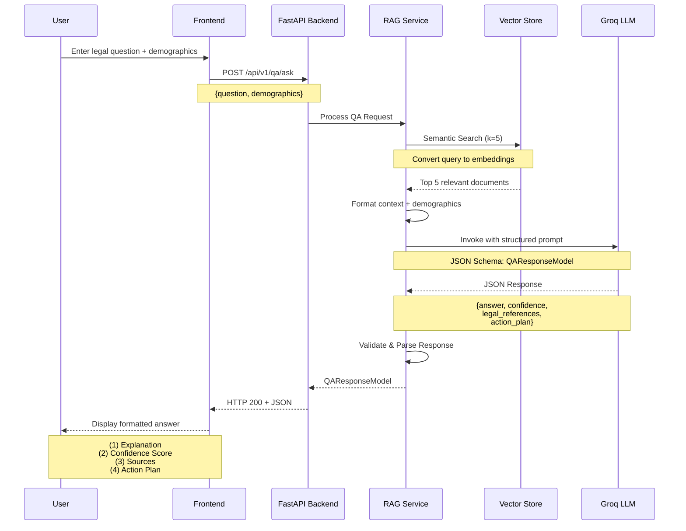

# Legal Sahayak: RAG‑Based Explainable Legal Copilot for India

[](https://opensource.org/licenses/MIT)
[](https://www.python.org/)
[](https://nextjs.org/)
[](https://fastapi.tiangolo.com/)

> [!Note]
> This project was developed as part of **EPICS** (Engineering Projects in Community Service), an initiative to apply engineering skills for social good and community empowerment.

## ❗ Problem Statement

Every day, millions of common people across India face situations requiring timely legal advice—ranging from landlord disputes and consumer rights to family law and labor issues. However:

### 1. Immediate Help Unavailable

Legal aid clinics and lawyers are often inaccessible due to cost, geography, or language barriers. In rural Madhya Pradesh, the lawyer-to-population ratio is approximately **1:10,000** compared to the national average of 1:1,200, leaving vast populations without legal representation.

### 2. Complexity of Legal Texts

National and state laws are voluminous, jargon‑laden, and constantly updated, making manual search slow and error‑prone. The Bharatiya Nyaya Sanhita (BNS) 2023 alone contains **358 sections**, while consumer protection, labor, and family laws add thousands more provisions.

### 3. Contextual Relevance Missing

A generic search may surface outdated or non‑applicable statutes. What matters most are:

- **Local regulations** (state-specific amendments)
- **Recent amendments** (BNS 2023, BNSS 2023)
- **User‑specific factors** (state, language, socio‑economic profile)

### 4. Lack of Explainability

Even when AI systems retrieve relevant sections, users can't trace **"why"** a particular clause applies or **how** it led to a recommended action plan. This black‑box approach erodes trust among vulnerable populations.

### 5. Digital Divide & Literacy Barriers

- **65%** of Madhya Pradesh's population lives in rural areas
- **70.6%** literacy rate (vs. 77.7% national average)
- Limited smartphone penetration and poor internet connectivity in tribal districts like Alirajpur, Barwani, and Jhabua

---

## 🚀 Our Solution

**Legal Sahayak** is an AI-powered, explainable legal assistance platform that democratizes access to legal information through an integrated system combining intelligent search, personalized explanations, and a comprehensive digital legal library.

### 1. Intelligent Legal Search & Retrieval

- **FAISS Vector Store**: Semantic search across 6+ domains of Indian law
- **Hybrid Retrieval**: Combines dense embeddings (HuggingFace Transformers) with keyword matching
- **Contextual Chunking**: Markdown-based hierarchical splitting preserves legal structure (Act → Chapter → Section)
- **Cross-references**: Automatically links related laws and provisions
- **Metadata Preservation**: Tracks source documents and specific legal sections

### 2. Demographic-Aware Personalization

Adapts explanations based on user profile:

- **Age & Education** → Simplifies legal language for users with lower literacy
- **Location** → Prioritizes MP-specific laws and local court procedures
- **Occupation** → Provides job-relevant examples (e.g., labor laws for factory workers)
- **Gender** → Ensures culturally sensitive responses for sensitive issues

### 3. Explainable AI Architecture

Every response includes structured information:

- **Plain-language Answer**: Legal explanation in simple terms
- **Confidence Score**: 0.9-1.0 (clearly defined), 0.6-0.8 (requires interpretation), <0.6 (recommends lawyer)
- **Legal References**: Direct citations to applicable laws and sections
- **Action Plans**: Step-by-step guidance with timelines, relevant authorities, required documents, and cost estimates

### 4. Bilingual Support (Hindi + English)

- Full application interface in Hindi and English
- Responsive language toggle for seamless switching
- Culturally relevant explanations adapted to local context
- Supports semi-literate users with simplified language options

### 5. Legal Library

- Interactive, searchable database of Indian laws
- Covers 6+ legal domains: Consumer Protection, Fundamental Rights, Marriage Laws (Hindu & Muslim), Labor Laws, Rental Laws
- Real-time document browsing with hierarchical navigation
- Quick reference guides for common legal scenarios

### 6. Privacy-First Design

- No storage of personal legal queries
- Demographic data used only for response generation
- GDPR-compliant data handling

---

## 🔄 Query Processing Flow (Architecture)


```mermaid
sequenceDiagram
    participant U as User
    participant F as Frontend
    participant API as FastAPI Backend
    participant RAG as RAG Service
    participant FAISS as Vector Store
    participant LLM as Groq LLM

    U->>F: Enter legal question + demographics
    F->>API: POST /api/v1/qa/ask
    Note over F,API: {question, demographics}

    API->>RAG: Process QA Request

    RAG->>FAISS: Semantic Search (k=5)
    Note over RAG,FAISS: Convert query to embeddings
    FAISS-->>RAG: Top 5 relevant documents

    RAG->>RAG: Format context + demographics
    RAG->>LLM: Invoke with structured prompt
    Note over RAG,LLM: JSON Schema: QAResponseModel

    LLM-->>RAG: JSON Response
    Note over LLM,RAG: {answer, confidence,<br/>legal_references,<br/>action_plan}

    RAG->>RAG: Validate & Parse Response
    RAG-->>API: QAResponseModel
    API-->>F: HTTP 200 + JSON
    F-->>U: Display formatted answer
    Note over F,U: (1) Explanation<br/>(2) Confidence Score<br/>(3) Sources<br/>(4) Action Plan
```

---

## 🛠️ Technology Stack

### Backend

- **Framework**: FastAPI 0.115+ (async, high-performance)
- **LLM**: Groq API (llama-3.3-70b-versatile or gpt-oss-120b)
- **Embeddings**: HuggingFace `sentence-transformers/all-MiniLM-L6-v2`
- **Vector DB**: FAISS (Facebook AI Similarity Search)
- **RAG Framework**: LangChain 0.3+
- **Schema Validation**: Pydantic v2

### Frontend

- **Framework**: Next.js 15 (App Router)
- **UI Library**: shadcn/ui + Radix UI
- **Styling**: Tailwind CSS
- **State Management**: React Hooks
- **Markdown Rendering**: react-markdown + remark-gfm

### Data Pipeline

- **Document Format**: Markdown (.md)
- **Text Splitting**: LangChain MarkdownHeaderTextSplitter
- **Indexing**: Python script (`build_vectorstore.py`)

---

## 📦 Installation & Setup

### Prerequisites

- **Python**: 3.11+
- **Node.js**: 18+
- **pnpm**: 8+ (or npm/yarn)
- **Git**: For cloning the repository

### 1. Clone the Repository

```bash
git clone https://github.com/sujeetgund/legalsahayak.git
cd legalsahayak
```

### 2. Backend Setup

#### a. Create Virtual Environment

```bash
cd backend
python -m venv venv

# Windows
venv\Scripts\activate

# macOS/Linux
source venv/bin/activate
```

#### b. Install Dependencies

```bash
pip install -r requirements.txt
```

#### c. Configure Environment Variables

Create a `.env` file in the `backend/` directory:

```env
# API Keys
GROQ_API_KEY=your_groq_api_key_here
GROQ_MODEL_NAME=llama-3.3-70b-versatile

# Embedding Model
EMBEDDING_MODEL_NAME=sentence-transformers/all-MiniLM-L6-v2

# Security
BEARER_TOKEN=your_secure_bearer_token

# Paths
DATA_DIR=data
FAISS_INDEX_DIR=faiss_index
```

#### d. Build Vector Store (optional)

```bash
python build_vectorstore.py
```

This will:

- Load documents from `data/` directory
- Split into hierarchical chunks
- Generate embeddings
- Create FAISS index in `faiss_index/`

#### e. Run Backend Server

```bash
uvicorn main:app --reload --host 0.0.0.0 --port 8000
```

Backend will be available at: `http://localhost:8000`

API docs: `http://localhost:8000/docs`

### 3. Frontend Setup

#### a. Install Dependencies

```bash
cd ../frontend
pnpm install
```

#### b. Configure Environment Variables

Create a `.env.local` file in the `frontend/` directory:

```env
BACKEND_SERVER_URL=http://localhost:8000/api/v1
```

#### c. Run Development Server

```bash
pnpm dev
```

Frontend will be available at: `http://localhost:3000`

### 4. Docker Deployment (Optional)

#### Full Stack with Docker Compose

```bash
# From root directory
docker-compose up --build
```

Services:

- Frontend: `http://localhost:3000`
- Backend: `http://localhost:8000`

---

## 🎯 Usage

### Web Interface

1. **Navigate to Chat Interface**: `http://localhost:3000`

2. **Fill User Profile** (one-time):
   - Age: 25-35
   - Gender: Male/Female/Other
   - Location: Bhopal, Madhya Pradesh
   - Education: Graduate
   - Occupation: Private Employee

3. **Ask Your Question**:

   ```
   Example: "My landlord is asking me to vacate without notice. What are my rights?"
   ```

4. **Review Response**:
   - **Explanation**: Plain-language answer
   - **Confidence Score**: 85%
   - **Legal References**: MP Rent Control Act, 1961 - Section 12
   - **Action Plan**:
     1. Check your rent agreement
     2. Send legal notice with 1-month period
     3. File complaint if harassment continues

### API Usage

#### Endpoint: `POST /api/v1/qa/ask`

**Request**:

```json
{
  "question": "What is the minimum wage in Madhya Pradesh for unskilled workers?",
  "demographics": {
    "age": 30,
    "gender": "Male",
    "location": "Indore, Madhya Pradesh",
    "education_level": "High School",
    "job_title": "Factory Worker"
  }
}
```

**Response**:

```json
{
  "answer": "As of 2024, the minimum wage for unskilled workers in Madhya Pradesh is ₹320 per day (₹9,600 per month for 30 days). This applies to industries covered under the Minimum Wages Act, 1948...",
  "confidence": 0.92,
  "legal_references": [
    "Minimum Wages Act, 1948 - Section 3",
    "MP Minimum Wages Notification 2024"
  ],
  "action_plan": [
    {
      "title": "Verify Your Wage Slip",
      "description": "Check if your employer is paying at least ₹320/day. If not, collect 3 months of wage slips as evidence."
    },
    {
      "title": "File Complaint with Labour Commissioner",
      "description": "Visit the nearest Labour Office (Office of the Commissioner, Labour Department, Indore). No fee required."
    },
    {
      "title": "Contact MP Labour Helpline",
      "description": "Call 155214 for immediate assistance and guidance on next steps."
    }
  ]
}
```

#### cURL Example

```bash
curl -X POST http://localhost:8000/api/v1/qa/ask \
  -H "Content-Type: application/json" \
  -H "Authorization: Bearer your_bearer_token" \
  -d '{
    "question": "How do I file a consumer complaint?",
    "demographics": {
      "age": 28,
      "gender": "Female",
      "location": "Bhopal, MP",
      "education_level": "Graduate",
      "job_title": "Teacher"
    }
  }'
```

---

## 📄 License

This project is licensed under the MIT License.
